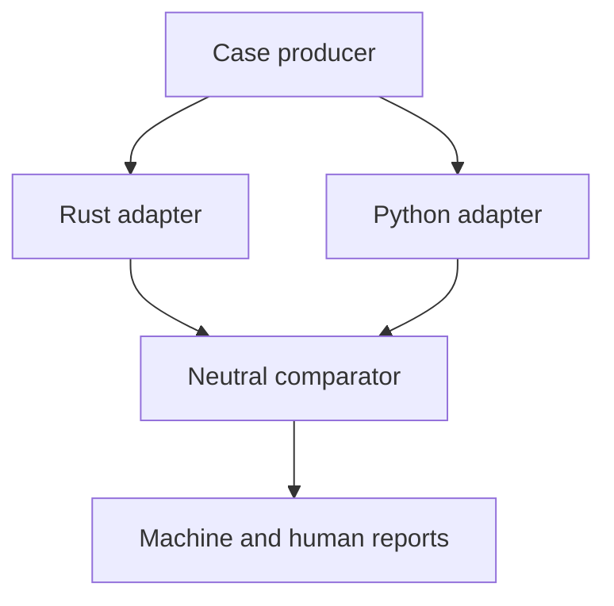

# Followee Conformance and Differential Harness

**Implementation brief v0.1**

**5 August 2026**

**Non-normative**

## 1. Purpose

This document specifies the first neutral conformance and differential-testing
harness for the Followee protocol core.

The harness gives two independently developed implementations the same inputs,
normalizes only their public results, and compares those results mechanically.
Its first targets are:

- the Rust reference implementation of Followee Sections 3 through 8; and
- the independently authored Python clean-room model of the same protocol core.

The harness is an examiner, not a third implementation. It MUST NOT contain a
second copy of Followee parsing, encoding, cryptography, verification, ordering,
or selection rules. It MUST NOT decide a disagreement by treating either target
as authoritative. The normative Followee specification governs every such
decision.

Successful comparison provides strong engineering evidence that two independent
implementations agree on the tested protocol behavior. It is not a formal proof,
and it does not by itself demonstrate the HTTP and relay interoperability required
by Followee Specification Section 20.4.

## 2. Governing specification and frozen targets

All work begins from these exact public revisions:

| Artifact | Repository | Immutable revision |
| --- | --- | --- |
| Followee Specification v0.7 | `followee-protocol/followee` | commit `abc9a55d90f1026e6509207abda73e5dc6d14241` |
| Rust protocol core | `followee-protocol/followee-rs` | tag `milestone-1-v0.7-conformance-api-reviewed`, commit `c30b2207aeccb4daa5fb06a388ecd0ec5e0ab625` |
| Python clean-room model | `followee-protocol/followee-python-cleanroom` | tag `cleanroom-v0.7-maintenance-freeze`, commit `a39138dae8072c7b89dc922bcfe6f5717312c6e6` |

The SHA-256 digest of the pinned `Followee-Specification.md` is:

```text
2b264823ba68d9a7d69ce68de5c1408ac8a3d54ff6d726ab89ee2baa2707c81f
```

For audit continuity, the harness report MUST also record:

- the conformance-API commit's parent — the reviewed Milestone 1 revision
  `774acb7578795cf6d58f77b76b16ef010114ebd6` (tag
  `milestone-1-v0.7-reviewed`), which remains the producing revision for
  the provisional fixtures imported from its manifests;
- the Rust review-fix commit's parent,
  `d23d660c1efb8e1c8f0095a2b44040bc44cf5160`;
- the Python v0.7 maintenance input commit,
  `6b944b952d1daec6840deae7e07f304f5349637d`;
- the original Python v0.6 freeze,
  `7ca1f623453065deefd1e6cfdf15e135d523dd7e`; and
- the reviewed Python v0.6 correction,
  `70e4a6caa8720f1dfbb3b183a5d305fca0cf3e57`.

Branches are convenient discovery mechanisms, not pins. A run MUST refuse to
start if a tag does not peel to the recorded commit, a submodule is dirty, or a
checked-out implementation differs from its expected commit.

If the normative specification changes, this document and the pins MUST be
reviewed together. A later run never silently reinterprets an old report under a
new specification.

## 3. Independence and trust model

The following rules are fundamental:

1. Neither implementation is the oracle.
2. Both implementations receive byte-identical or semantically identical input,
   as appropriate to the operation.
3. The frozen implementation cores are read-only during a comparison campaign.
4. Adapters translate data; they do not implement protocol decisions.
5. Clocks, seeds, ordering, limits, and corpus versions are explicit.
6. A disagreement is retained and investigated. It is never normalized away.
7. Agreement promotes a fixture only when its bytes and expected result remain
   unchanged and the independence requirements in the implementation brief are
   satisfied.
8. A harness defect, adapter defect, specification ambiguity, and implementation
   defect are distinct outcomes.
9. No majority vote can change normative behavior, even after more
   implementations are added.

The Python model's clean-room authoring phase is complete and frozen. The harness
may now provide provisional input cases to it, but MUST NOT alter the model or
feed expected Rust outputs into its source. The Rust implementation similarly
remains unchanged while its results are compared.

## 4. Architecture



The harness owns case selection, process supervision, resource limits,
comparison, and reporting. Each adapter owns only the translation between the
neutral runner protocol and one frozen implementation's public API.

The initial orchestrator SHOULD be Python 3.10 or later and SHOULD use only the
standard library. This choice is for transparent process and JSON handling; it
does not make the Python protocol model authoritative.

Adapters are persistent subprocesses speaking newline-delimited JSON over
standard input and output. Persistence makes large differential campaigns
practical without coupling the two implementations in one address space.

## 5. Repository layout

The intended layout is:

```text
followee-conformance/
├── HARNESS.md
├── README.md
├── LICENSE
├── .gitignore
├── specification/                      # pinned Git submodule
├── implementations/
│   ├── followee-rs/                    # pinned Git submodule
│   └── followee-python-cleanroom/      # pinned Git submodule
├── adapters/
│   ├── rust/                           # separate Cargo package
│   └── python/                         # runner only; no model copy
├── harness/                            # orchestration and comparison
├── schemas/                            # runner and case JSON Schemas
├── cases/
│   ├── specification/
│   ├── implementation/
│   └── confirmed/
├── reports/                            # retained summaries, not scratch logs
└── scripts/                            # pin checks and reproducible commands
```

The two implementation directories MUST be Git submodules pinned to the commits
in Section 2. The `specification/` directory MUST be a third Git submodule,
pinned to the `followee-protocol/followee` commit in Section 2; it is the
harness's neutral source of the normative specification bytes, independent of
any copy vendored by either implementation. The Rust adapter uses a path
dependency on the Rust submodule. The Python adapter imports
`tools/python-model` from the Python submodule without copying or modifying it.

Submodules retain their own licenses and histories. The MIT license of this
repository applies only to the harness material authored here.

## 6. Acquisition and integrity checks

Before building an adapter, the harness MUST verify:

- both required submodules are initialized;
- each submodule `HEAD` equals its pinned commit;
- each relevant public tag peels to that commit;
- each submodule working tree is clean;
- the specification bytes at `specification/Followee-Specification.md`, read
  from the neutral pinned specification checkout, have the SHA-256 digest in
  Section 2;
- the Python model remains at its frozen revision; and
- the Rust core remains at its reviewed revision.

The checks MUST be automated and run locally and in CI. A failed integrity check
is an infrastructure failure, not a conformance result.

After checkout and dependency installation, the actual comparison run SHOULD be
able to execute without network access.

## 7. Neutral runner protocol

### 7.1 Transport

Runner protocol v1 is UTF-8 JSON Lines:

- one complete JSON object per input line;
- one complete JSON object per output line;
- no byte-order mark;
- no blank protocol lines;
- protocol responses only on standard output;
- diagnostics only on standard error; and
- a default maximum line length of 1 MiB in each direction.

The orchestrator starts each adapter once, performs a handshake, and then sends
requests sequentially. Parallelism, if later added, MUST preserve `caseId`
correlation and deterministic report ordering.

An adapter SHOULD answer an ordinary request within five seconds. A timeout,
crash, malformed response, unexpected extra output, or exceeded line limit is an
adapter/infrastructure failure. It MUST NOT be converted into a Followee
rejection.

### 7.2 JSON profile

Runner JSON is not a Followee wire format. It obeys these additional rules:

- unknown object members are rejected;
- duplicate JSON object names are rejected;
- every JSON number token is forbidden, integral tokens included; no
  conformant runner line contains a bare number;
- every protocol integer is encoded as an unsigned or signed canonical decimal
  string, with `"0"` as zero and no leading zeroes;
- every binary value is lowercase, even-length hexadecimal without `0x`;
- enumerated strings are case-sensitive; and
- arrays preserve order while ordinary JSON object member order is irrelevant.

Decimal strings avoid accidental loss of 64-bit precision in future adapters.
Adapters MUST reject a value outside the operation's protocol range before
calling the implementation.

### 7.3 Common request and response

Every request has this shape:

```json
{
  "runnerProtocol": "1",
  "caseId": "appendix-b4",
  "operation": "verifyRecord",
  "input": {}
}
```

An accepted protocol operation returns:

```json
{
  "runnerProtocol": "1",
  "caseId": "appendix-b4",
  "status": "accepted",
  "result": {}
}
```

A Followee-level rejection returns:

```json
{
  "runnerProtocol": "1",
  "caseId": "appendix-b7-17a",
  "status": "rejected",
  "error": "schemaViolation"
}
```

An adapter unable to execute the request returns `status: "adapterError"` with a
stable harness error symbol and a diagnostic message. `adapterError` never equals
`rejected` and always fails the campaign.

Responses MUST repeat the request's `runnerProtocol` and `caseId` exactly.

## 8. Handshake and capabilities

The first request sent to each process is:

```json
{
  "runnerProtocol": "1",
  "caseId": "handshake",
  "operation": "hello",
  "input": {}
}
```

The response result contains at least:

```json
{
  "adapter": "followee-rust",
  "adapterVersion": "1",
  "implementationRepository": "https://github.com/followee-protocol/followee-rs",
  "implementationCommit": "c30b2207aeccb4daa5fb06a388ecd0ec5e0ab625",
  "specificationCommit": "abc9a55d90f1026e6509207abda73e5dc6d14241",
  "runnerProtocols": ["1"],
  "operations": ["deriveIdentity", "authorRecord", "verifyRecord"]
}
```

The Python adapter reports its own repository and frozen commit. The harness
MUST refuse to compare adapters whose specification commits, runner versions, or
required capabilities do not match the campaign.

The commit values SHOULD be supplied by the build or verified checkout, not
accepted from an unchecked runtime environment variable. An adapter MAY report
`specificationCommit` from the harness-verified `specification/` submodule
checkout, at build time or at startup; the orchestrator MUST cross-check every
reported commit against the Section 2 pins before comparing anything.

## 9. Runner operations

Runner v1 defines the operations below. Their schemas are committed under
`schemas/` and are normative for the harness itself.

### 9.1 `deriveIdentity`

Input:

```json
{
  "rootSeedHex": "<32 bytes>",
  "revocationSeedHex": "<32 bytes>"
}
```

Accepted result:

```json
{
  "rootPublicKeyHex": "<32 bytes>",
  "revocationPublicKeyHex": "<32 bytes>",
  "revocationPublicKeyCborHex": "<bytes>",
  "revocationCommitmentHex": "<32 bytes>",
  "authorityDescriptorCborHex": "<bytes>",
  "authorityDescriptorDigestHex": "<32 bytes>",
  "did": "did:flw:..."
}
```

Every field is compared exactly. The operation uses only public test seeds. It
MUST NOT be exposed as a general secret-key service.

### 9.2 `authorRecord`

This operation supplies a complete semantic record plus the applicable private
test seed. Its input contains:

- `rootSeedHex` and `revocationSeedHex`;
- `authority`, either `root` or `rootRevoked`;
- `timestampMs`;
- optional `validUntilMs`;
- a complete `contact` value;
- record-level `extensions`; and
- `signingSeed`, either `root` or `revocation`.

The adapter derives the Authority Descriptor and DID from the two seeds, creates
the complete record, validates the typed authoring path, and signs with the named
seed. It MUST reject incoherent authority/signing-key combinations rather than
silently choosing a different key.

Accepted output contains:

```json
{
  "did": "did:flw:...",
  "recordBodyCborHex": "<bytes>",
  "recordBodyDigestHex": "<32 bytes>",
  "sigStructureHex": "<bytes>",
  "signatureHex": "<64 bytes>",
  "envelopeHex": "<bytes>"
}
```

All outputs are deterministic and compared byte-for-byte. Adapters MAY use the
implementation's public authoring functions in several calls, but MUST NOT
reimplement canonical CBOR, COSE, key derivation, or signing in adapter code.

### 9.3 `verifyRecord`

Input:

```json
{
  "targetDid": "did:flw:...",
  "envelopeHex": "<received bytes>",
  "nowMs": "1785598800123"
}
```

An accepted result contains at least:

```json
{
  "envelopeHex": "<exact received bytes>",
  "recordBodyCborHex": "<exact received payload bytes>",
  "recordBodyDigestHex": "<32 bytes>",
  "id": "did:flw:...",
  "timestampMs": "1785598800123",
  "authority": "root",
  "validUntilMs": null,
  "premature": false,
  "stale": false,
  "record": {}
}
```

`record` is the canonical runner representation of the complete verified
semantic record, including the descriptor, contact document, migrations, and
extensions. It is not produced by serializing an implementation's debug object.
The adapter explicitly maps public fields into the runner schema.

Verification and recipient-time classification are both exercised. The adapter
MUST pass `nowMs` to the implementation's time-classification functions rather
than reading the system clock.

On failure, `error` is the implementation's symbolic Followee error. For cases
whose manifest says `errorAssertion: unspecified`, the harness compares only
rejection, though it retains both reported errors for diagnosis.

### 9.4 `selectCurrent`

Input contains:

```json
{
  "targetDid": "did:flw:...",
  "candidateEnvelopeHex": ["<bytes>", "<bytes>"],
  "nowMs": "1785598800123",
  "stickyAuthority": "unknown"
}
```

`stickyAuthority` is one of `unknown`, `root`, or `rootRevoked`.

The adapter verifies every candidate for the explicit target and then invokes
the implementation's public selection behavior. The result contains:

```json
{
  "winnerRecordBodyDigestHex": "<32 bytes or null>",
  "authorityState": "rootRevoked"
}
```

Invalid, premature, stale, duplicate, losing, and non-target candidates are not
silently rewritten. Per-candidate verification outcomes are tested separately;
runner v1 compares the final winner and resulting sticky authority state.

### 9.5 `strictEd25519`

Input contains a 32-byte public key, arbitrary message bytes, and a 64-byte
signature. The accepted result is:

```json
{ "valid": false }
```

`valid: false` is a successful execution of the primitive, not a rejected runner
request. This operation MUST call the same strict verification entry point used
by complete record verification.

### 9.6 `nextTimestamp`

Input contains explicit `nowMs` and optional `previousTimestampMs`. The result is
the exact next timestamp or the implementation's timestamp overflow/error
classification. System time is forbidden.

### 9.7 `validateCbor`

Input contains arbitrary `cborHex` plus the explicit depth and member limits
applicable to the test. The result reports acceptance or one of the implementation
classifications `invalidCbor`, `nonDeterministicCbor`, or `schemaViolation`.

This operation invokes the same deterministic-CBOR validator used by the record
path. It does not turn the adapter into a CBOR parser.

## 10. Semantic value representation

JSON objects cannot faithfully represent CBOR maps with non-text keys, duplicate
keys, or integer widths. Structured authoring cases therefore use a typed value
tree for extension values and deliberately malformed construction inputs:

```json
{ "type": "uint", "value": "1" }
{ "type": "nint", "value": "-1" }
{ "type": "bytes", "hex": "00ff" }
{ "type": "text", "value": "hello" }
{ "type": "bool", "value": true }
{ "type": "null" }
{ "type": "array", "items": [] }
{
  "type": "map",
  "entries": [
    {
      "key": { "type": "uint", "value": "1" },
      "value": { "type": "text", "value": "one" }
    }
  ]
}
```

Map entries are arrays in source order so duplicates remain representable.
Extension keys use the subset allowed by the specification. The harness schema
MUST enforce the protocol's permitted value domain; adapters still use their
implementation to enforce Followee validity.

The ordinary Contact Document representation uses named JSON members for:

- display name;
- bio;
- avatar URI;
- `alsoKnownAs` URIs;
- service entries;
- migration predecessor and successor DIDs; and
- contact-level extensions.

Service entries expose the semantic fields defined by the pinned specification,
not CBOR labels. URI and language strings are preserved exactly; adapters MUST
NOT lowercase, normalize, resolve, or otherwise rewrite them.

## 11. Error vocabulary

Core operations use the symbolic error names from Followee Specification v0.7:

| Code | Symbol |
| ---: | --- |
| 0 | `invalidDid` |
| 1 | `unsupportedHash` |
| 2 | `unsupportedSuite` |
| 3 | `recordTooLarge` |
| 4 | `invalidCbor` |
| 5 | `nonDeterministicCbor` |
| 6 | `schemaViolation` |
| 7 | `identityBindingMismatch` |
| 8 | `invalidRevocationKey` |
| 9 | `invalidSignature` |
| 10 | `premature` |
| 11 | `rootRevoked` |
| 12 | `losingRecord` |
| 13 | `duplicate` |
| 14 | `policyRejected` |
| 15 | `rateLimited` |
| 16 | `responseTooLarge` |
| 17 | `temporarilyUnavailable` |
| 18 | `invalidCursor` |
| 19 | `internalError` |

The first harness slice primarily exercises codes 0 through 13. Adapter and
runner failures use a separate namespace beginning `adapter.` or `harness.` and
MUST NOT reuse Followee error symbols.

Staleness is accepted-record metadata, not a verification error. A premature
record can verify cryptographically while being inadmissible at the supplied
recipient time; operation schemas MUST preserve that distinction.

## 12. Cases and provenance

Every retained case has a stable ID and a machine-readable manifest containing:

- runner protocol version and operation;
- complete input or paths plus content digests;
- relevant specification version and section citations;
- expected acceptance or rejection where normatively known;
- `faultProfile`: `none`, `single`, `multiple`, or `unknown`;
- for rejecting cases, `errorAssertion`: `exact` or `unspecified`;
- the exact symbolic error only when `errorAssertion` is `exact`;
- derivation status;
- positive base vector and logical mutation for derived negatives;
- whether protected or payload bytes changed;
- whether the result was re-signed, and with which published test key;
- producing implementation, if any; and
- independent confirmation revisions.

Derivation status has the same meaning as in the Rust implementation brief:

| Status | Meaning |
| --- | --- |
| `specification` | Exact bytes or the exact expected result are normatively published by the pinned specification. |
| `implementation` | The case has so far been derived or reproduced by only one implementation. |
| `confirmed` | At least two implementations with no shared protocol core independently reproduce the unchanged result. |

A citation to normative prose alone does not make computed bytes
`specification`-status. Promotion from `implementation` to `confirmed` changes
metadata only. The input bytes and expected result MUST NOT change during
promotion.

For multi-fault cases, exact symbolic-error equality is required only where the
specification defines precedence. Otherwise both implementations need only
reject, and the report records their possibly different error symbols.

The harness MUST validate every manifest against a committed schema before
executing it. Inconsistent shapes such as `exact` without `error`, `unspecified`
with `error`, or an accepted result carrying error fields are rejected as harness
errors.

## 13. Comparison rules

| Operation | Required equality |
| --- | --- |
| `deriveIdentity` | All public keys, CBOR bytes, commitments, digests, and DID text exactly equal. |
| `authorRecord` | Both accept or both reject; accepted body, digest, Sig_structure, signature, envelope, and DID exactly equal. |
| `verifyRecord` | Same accept/reject result; exact error when required; accepted exact received bytes, digest, semantic record, authority, timestamp, premature, and stale classifications equal. |
| `selectCurrent` | Winner body digest or absence, and resulting sticky authority state, exactly equal. |
| `strictEd25519` | Boolean result exactly equal. |
| `nextTimestamp` | Exact timestamp or exact specified boundary error equal. |
| `validateCbor` | Same accept/reject result; exact symbolic error only where the case requires it. |

JSON object member order is ignored. Array order, text code points, decimal
strings, binary bytes, `null`, and every semantic value are significant.

An adapter MAY expose extra diagnostic data only under a namespaced `diagnostic`
member that is excluded from equality and retained in reports. Normative result
fields may never be excluded merely because they disagree.

## 14. Test phases

Every complete campaign runs these phases in order:

### 14.1 Integrity and handshake

Verify pins, tags, clean submodules, specification digest, adapter capabilities,
and tool versions before executing a protocol case.

### 14.2 Specification cases

Run all machine-readable Appendix B positive vectors and required Appendix B.7
and B.8 negative behavior, including:

- exact DID, descriptor, digest, body, Sig_structure, signature, and envelope
  reproduction;
- descriptor-substitution rejection despite a valid attacker signature;
- the `S + L` signature case;
- exact Boolean-versus-integer CBOR label typing from Appendix B.7 item 17; and
- the v0.7 URI behavior for fragments, queries, relative references, and both
  `IPvFuture` introducer cases.

### 14.3 Retained implementation cases

Run provisional Rust-authored cases against both frozen implementations. The
Python model sees their inputs only after its recorded freeze. Expected Rust
outputs are not adapter inputs.

### 14.4 Valid structured generation

Generate identity seeds, Contact Documents, complete Root and RootRevoked
records, boundary-sized values, optional fields, extensions, migrations, and
service metadata. Compare deterministic authoring and subsequent verification.

### 14.5 Deterministic malformed generation

Mutate envelopes, protected headers, body encodings, descriptors, DIDs, keys,
signatures, limits, and semantic fields. Re-sign signed material when the case
intends to isolate a non-signature fault. Multi-fault byte mutations remain useful
for accept/reject comparison but do not acquire invented exact-error assertions.

### 14.6 Selection and state

Generate mixed-identity candidate sets and compare explicit-target selection,
equal-time digest ordering, duplicate handling, premature exclusion, stale
metadata, absolute RootRevoked precedence, no Root fallback, and monotone sticky
revocation. Run multiple permutations of each set.

### 14.7 Repeatability

Repeat exact cases within each adapter process and in a fresh process. Identical
inputs MUST produce identical protocol outputs. Reports sort by case ID, never by
completion timing.

## 15. Deterministic corpus generation

The harness MUST NOT use language-specific pseudo-random generators as its
portable corpus definition. Runner v1 uses a counter-mode SHA-256 stream:

```text
block(i) = SHA-256(
    "Followee/ConformanceGenerator/v1\0" || seed32 || uint64_be(i)
)
```

Bytes are consumed left to right from consecutive blocks. Rejection sampling is
used where a bounded unbiased integer is required. The generator algorithm,
seed, case index, and generator version appear in every failure report.

Generated expected outputs come only from implementation comparison. The
generator MUST NOT reproduce Followee signing, verification, CBOR, ordering, or
URI rules in order to predict a result.

Two profiles are required:

- `ci-smoke`: small enough for every ordinary push; and
- `release-full`: the reviewed Milestone 1.5 evidence run.

Unless review establishes better values, `release-full` includes at least:

| Corpus | Minimum |
| --- | ---: |
| Derived identities | 1,000 |
| Valid authored records | 500, balanced across both authority states |
| Verification and boundary cases | 1,000 |
| Candidate-selection sets | 250, with at least 8 permutations each |
| Deterministic malformed byte cases | 10,000 |
| Exact-case executions | Twice per adapter, including fresh-process replay |

All counts are configuration recorded in the report. Raising them does not
silently change the named corpus version.

## 16. Disagreements and review

For every disagreement, the harness writes a self-contained immutable artifact
containing:

- the exact request;
- both exact responses;
- adapter standard-error excerpts and digests;
- harness, specification, and implementation commits;
- submodule status and tool versions;
- corpus profile, generator version, seed, and case index;
- fixture provenance;
- the comparison rule that failed; and
- a command for reproducing only that case.

The campaign then fails. The disagreement is classified by review as one of:

- harness schema or comparator defect;
- Rust adapter defect;
- Python adapter defect;
- Rust implementation defect;
- Python implementation defect;
- normative specification ambiguity or defect; or
- expected non-equality incorrectly demanded by this document.

The classification is never inferred by majority vote. Review begins with the
smallest reproducing input and the pinned normative text.

If an implementation requires correction, its frozen tag is not moved. The fix
receives a new commit and, after review, a new immutable tag. The complete
campaign is rerun against the new pair. Previous reports remain historical
evidence.

## 17. Reports

Each campaign produces:

- a machine-readable JSON report;
- a concise Markdown summary;
- zero or more disagreement artifacts; and
- a digest manifest covering all retained inputs and outputs.

The summary records:

- every pinned revision and tag;
- harness commit and runner protocol;
- operating system, architecture, Rust toolchain, and Python version;
- exact invocation and configuration;
- fixture-set digests;
- counts by operation, provenance status, fault profile, and result;
- exact-error and acceptance-only comparison counts;
- repeatability results;
- elapsed timing as non-normative diagnostics; and
- every unresolved disagreement.

A campaign passes only with zero adapter failures, zero harness failures, and zero
unresolved required differences. Its conclusion SHOULD be described as
"independent core differential-conformance evidence." It MUST NOT claim complete
Followee relay interoperability or mathematical proof.

Reports intended as milestone evidence are committed. High-volume scratch and
minimization output is ignored unless it demonstrates a retained issue.

## 18. Resource and security rules

- Only published test seeds are used. No production key material belongs here.
- All clocks are explicit. No protocol result depends on wall-clock time.
- All portable randomness comes from the generator in Section 15.
- Inputs are length-checked before hexadecimal decoding or allocation.
- The 1 MiB runner-line cap is independent of, and does not weaken, Followee's
  smaller normative record limits.
- Adapters run as ordinary subprocesses in isolated temporary working
  directories.
- Comparison runs SHOULD have network access disabled after dependencies are
  available.
- A crash, panic, exception, timeout, or excessive output is retained as an
  infrastructure failure with the triggering input.
- Sequential execution is the deterministic default. Parallel execution is an
  optimization and cannot alter case selection or report order.
- Adapter logs MUST NOT contain private environment variables or unrelated local
  paths.

## 19. CI

CI runs at least:

- submodule and tag integrity checks;
- specification digest verification;
- JSON Schema validation;
- harness unit tests;
- both adapter unit tests;
- formatting and linting for harness and adapters;
- the `hello` handshake and pin refusal tests;
- all specification-status cases; and
- the deterministic `ci-smoke` corpus.

CI MUST include a negative integrity test proving that a wrong implementation
commit is refused. It SHOULD prove that stdout pollution, malformed JSON,
duplicate JSON names, non-canonical integers, uppercase hexadecimal, timeout,
and adapter crash are classified as harness failures rather than Followee
rejections.

The larger `release-full` campaign may be a manually triggered workflow, but its
configuration and commands are committed and reproducible locally.

No ordinary test depends on the public Internet.

## 20. Milestones

### Milestone 0: neutral scaffold

Deliver:

- both pinned Git submodules;
- combined `.gitignore` and documented setup commands;
- committed runner and case JSON Schemas;
- one minimal adapter process for each implementation;
- `hello` only, with verified build-time or checkout identity;
- an orchestrator that launches both processes and refuses incorrect pins;
- harness unit tests for JSONL framing and infrastructure failures; and
- CI for the scaffold.

Acceptance:

- a fresh clone with initialized submodules builds both adapters;
- both exact tags and commits are verified;
- the orchestrator completes the two handshakes;
- dirty or wrong submodules fail before protocol execution;
- malformed adapter behavior cannot be mistaken for conformance; and
- no Followee protocol operation is claimed yet.

Stop at this gate for review. Do not begin protocol adapters in the first coding
session.

### Milestone 1: identity, authoring, and verification

Deliver `deriveIdentity`, `authorRecord`, and `verifyRecord`, plus the complete
specification-status corpus.

Acceptance:

- Appendix B positive values reproduce exactly in both implementations;
- required negative cases produce the specified portable result;
- accepted records preserve exact received bytes;
- adapter code contains no Followee crypto, CBOR, DID, or verification
  implementation; and
- every result field is compared and covered by an adapter test.

### Milestone 2: primitives and selection

Deliver `strictEd25519`, `nextTimestamp`, `validateCbor`, and `selectCurrent`,
then import the provisional Rust fixture inputs without revealing expected values
to the Python model's source.

Acceptance:

- strict Ed25519 edge cases execute through each production verifier;
- selection agrees across mixed-identity permutations and sticky states;
- fixture provenance validates; and
- unchanged agreements are eligible for `confirmed` review.

### Milestone 3: generated campaigns and reports

Deliver the portable deterministic generator, malformed campaigns, minimizable
case recording, JSON and Markdown reports, and both corpus profiles.

Acceptance:

- the same seed selects byte-identical requests on repeated runs;
- every disagreement is exactly reproducible;
- reports are deterministic apart from explicitly marked diagnostic timing; and
- CI smoke is bounded and green.

### Milestone 4: Milestone 1.5 evidence release

Run and review `release-full`, promote eligible unchanged fixtures, and publish
the report.

Acceptance:

- all Section 2 pins and content digests are verified;
- both frozen implementation cores remain byte-for-byte unchanged;
- every required specification and confirmed case passes;
- the minimum generated corpus in Section 15 passes;
- fresh-process repeatability passes;
- there are no unresolved required differences;
- promotions alter provenance metadata only; and
- the report states the limited evidence claim from Section 17.

## 21. Non-goals for the first harness

The first harness does not:

- test relay HTTP or WebFinger endpoints;
- administer or deploy relays;
- benchmark performance;
- replace either implementation's fuzzing, mutation testing, or unit tests;
- provide a formal proof;
- choose protocol behavior by implementation consensus;
- modify or repair a frozen implementation;
- define a new Followee wire format; or
- establish compliance for protocol sections it does not exercise.

Relay-to-relay and browser-to-relay interoperability belongs in a later harness
layer after the core differential gate is complete.

## 22. Working rules for coding agents

An agent implementing this brief MUST:

1. read this document completely;
2. read the pinned Followee specification completely before implementing a
   protocol operation;
3. inspect only the public APIs needed to write the two thin adapters;
4. work one milestone at a time and stop at its acceptance gate;
5. keep both implementation submodules read-only and clean;
6. never copy implementation code from one target into the other adapter;
7. never add protocol logic to make two answers agree;
8. preserve and report every discrepancy;
9. add a test for every harness or adapter defect found in review;
10. avoid committing, tagging, or pushing unless explicitly instructed; and
11. begin with Milestone 0 only.

If a required public API is absent, the agent records the exact gap and stops.
It does not reach into private internals, patch a frozen implementation, or
reimplement the missing protocol behavior in an adapter without review.

## Appendix A. Minimal protocol transcript

```json
{"runnerProtocol":"1","caseId":"handshake","operation":"hello","input":{}}
{"runnerProtocol":"1","caseId":"handshake","status":"accepted","result":{"adapter":"followee-rust","adapterVersion":"1","implementationRepository":"https://github.com/followee-protocol/followee-rs","implementationCommit":"774acb7578795cf6d58f77b76b16ef010114ebd6","specificationCommit":"abc9a55d90f1026e6509207abda73e5dc6d14241","runnerProtocols":["1"],"operations":["hello"]}}
```

The transcript is compact only to emphasize that each JSON object occupies one
physical line. Stored case files and reports SHOULD be formatted for review.

## Appendix B. Completion criterion

Milestone 1.5 is complete when two unchanged, independently developed protocol
cores, both pinned to Followee Specification v0.7, produce the same portable
result over the reviewed specification fixtures, eligible provisional fixtures,
and deterministic generated corpus, with no unresolved required difference and
with a reproducible public report explaining exactly what was and was not tested.
